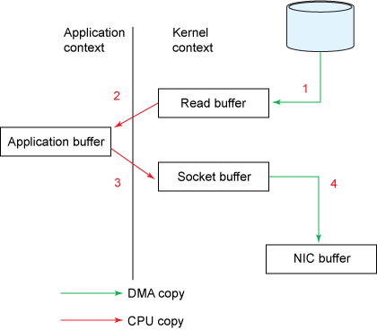
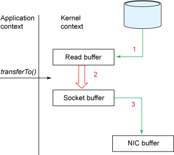
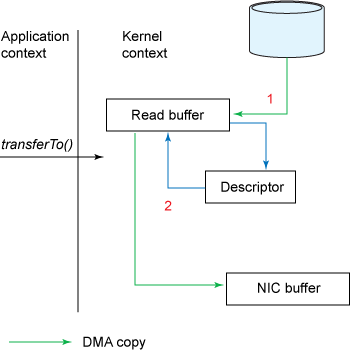

# Why Kafka is Fast?


## Low Level

### Broker Performace

- __Log Structured Persistence__:
    - Kafka utilizes a __segmented, append-only log__, largely limiting itself to __sequential I/O__ for both reads and writes, which is fast across a wide variety of storage media

    - There is __a wide misconception that disks are slow__; The performance of random I/O is slower when compared to sequential I/O. Furthermore, a modern operating system provides read-ahead and write-behind techniques that prefetch data in large block multiples and group smaller logical writes into large physical writes.

- __Batch Compression__
    - Compression becomes generally more effective as the data size increases. Especially when using text-based formats such as JSON, the effects of compression can be quite pronounced, with compression ratios typically ranging from 5x to 7x. 

    - Record batching is largely done as a client-side operation, which __transfers the load onto the client__ and has a __positive effect__ not only on __the network bandwidth__ but also on __the brokers’ disk I/O utilization__.

- __Unflushed buffered writes__:

    - Kafka __doesn’t actually call fsync__ when writing to the disk before acknowledging the write; the __only requirement for an ACK is that the record has been written to the I/O buffer__. 

    - __Kafka is a disk-backed in-memory queue__ (limited by the size of the buffer/pagecache)

    - On the flip side, __this form of writing is unsafe__, as __the failure of a replica can lead to a data loss even though the record has seemingly been acknowledged__.

    - __The combination of a non-blocking approach to I/O with no fsync, and redundant in-sync replicas__ give Kafka the combination of high throughput, durability, and availability.

- __Zero-copy__:

    - One of the typical sources of __inefficiencies is copying byte data between buffers__

    - Kafka uses a binary message format that is shared by the producer, the broker, and the consumer parties so that data chunks can flow end-to-end without modification, even if it’s compressed.

    - Kafka solves this problem on Linux and UNIX systems by using Java’s NIO framework, specifically, the ```transferTo()``` method of a ```java.nio.channels.FileChannel```. This method permits the transfer of bytes from a source channel to a sink channel without involving the application as a transfer intermediary

    - The traditional approach where a source channel is read into a byte buffer, then written to a sink channel as two separate operations:
    
        

    - Zero-copy approach, under the following model, the number of context switches is reduced from 4 to 2, the number of copies between buffers is reduced from 4 to 3. But its __not query zero-copy __yet:

        

    - A further optimization is achieved when running Linux kernels 2.4 and later,  on network interface cards that support the ```gather``` operation. Calling the transferTo() method causes the device to read data into a kernel read buffer by the DMA engine, as per the previous example. However, with the gather operation, there is no copying between the read buffer and the socket buffer. Instead, the NIC is given a pointer to the read buffer, along with the offset and the length, which is vacuumed up by DMA. At no point is the CPU involved in copying buffers:

        

- __Avoiding the GC__:
    - The heavy use of __channels, native buffers, and the page cache__ has one additional benefit — __reducing the load on the garbage collector (GC)__

### __Client-side Optimisations__

- A __significant amount of work is performed on the client before records get to the server__. This includes the staging of records in an accumulator, __hashing the record keys to arrive at the correct partition index, checksumming the records and the compression__ of the record batch.

- A producer client will forward writes directly to partition masters. Similarly, consumer clients are able to make intelligent decisions when sourcing records, potentially using replicas that geographically closer to the client when issuing read queries.

- __Record Batching__:
    - In fact, quite often the __bottleneck with Kafka__ isn’t the disk, but __the network__.

    - Kafka clients and brokers will accumulate __multiple records in a batch — for both reading and writing__ — before sending them over the network. Batching of records amortizes the overhead of the network round-trip, using larger packets and improving bandwidth efficiency.

- __Cheap consumers__:
    - Unlike traditional MQ-style brokers which remove messages at point of consumption (incurring the penalty of random I/O), Kafka doesn’t remove messages after they are consumed.

    - The progression of offsets themselves is published on an internal Kafka topic __consumer_offsets__ (compacted topics)

    - Consumers in Kafka are ‘cheap’, insofar as they don’t mutate the log files (only the producer or internal Kafka processes are permitted to do that). It is mostly sequential reads with a low rate of sequential writes.

### Stream parallelis

- Concurrency is ingrained into its partitioning scheme and the operation of consumer groups, which is effectively a load-balancing mechanism within Kafka — distributing partition assignments approximately evenly among the individual consumer instances within the group.

- The __partitioning mechanism__ also allows for the horizontal scalability of Kafka brokers. Every partition has a dedicated leader; any nontrivial topic (with multiple partitions) can, therefore, __utilize the entire cluster of broker for writes__.
Kafka will genuinely balance the load across the brokers for availability, durability, and throughput.

- Kafka guarantees that a partition may only be assigned to __at most one consumer within its consumer group__. Note that a consumer could be a process or a thread. Depending on the type of workload that the consumer performs, you may be able to employ multiple individual consumer threads or process records in a thread pool.

## References:

- https://medium.com/swlh/why-kafka-is-so-fast-bde0d987cd03