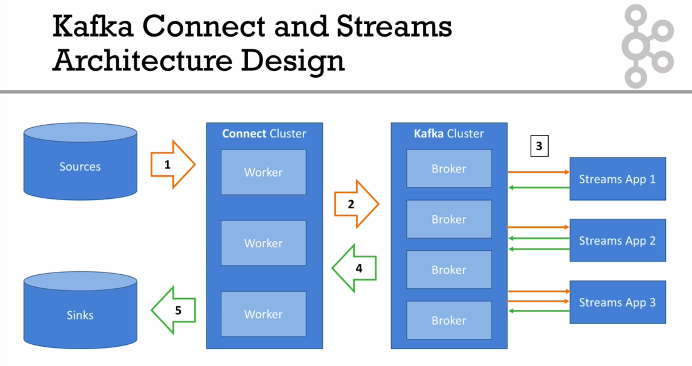
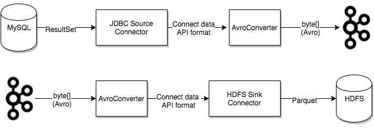

# Kafka Connect

## What Is Kafka Connect?

- Simplify and improve get data in and out of Kafka

- Achieve Fault Totlerance, Exactly Once, Distribution, Ordering (by other programmers)

#
## Kafka Connect Architecture Design


## Fundamental Concepts

### Connector

- The high level abstraction that coordinates data streaming by managing tasks

- Kafka Connect Cluster has multiple loaded Connectors

- Each connector is a re-usable piece of code (java jars)

- Many connectors exists in the open source world.

### Task

- Tasks: the implementation of how data is copied to or from Kafka

- Task = Connector + __User Configuraton__

- A Task is linked to connector configuration

- A job configuration may spawn multiple tasks

- Tasks have no state stored within them. Task state is stored in Kafka in special topics ```config.storage.topic``` and ```status.storage.topic``` and managed by the associated connector.

### Worker

- Workers are the running processes that execute connectors and tasks

- A worker is a single process

- A worker can be standalone or in a cluster

### Converter

- The code used to translate data between Connect and the system sending or receiving data

- Tasks use converters to change the format of data from bytes to a Connect internal data format and vice versa.



### Transform

- A transform is a simple function that accepts one record as an input and outputs a modified record.

### Dead Letter Queue

- How Connect handles connector errors

- The error is handled based on the connector configuration property ```errors.tolerance```:
    - ```none```: An error or invalid record causes the connector task to __immediately fail and the connector goes into a failed state__. To resolve this issue, you would need to review the Kafka __Connect Worker log__ to find out what caused the failure, correct it, and __restart the connector__.

    - ```all```: All errors or invalid records are ignored and processing continues. No errors are written to the Connect Worker log.

- Dead Letter Queue Topic contains records that could not be processed by the sink connector:
    ```
    "errors.tolerance": "all",
    "errors.deadletterqueue.topic.name": "dlq-gcs-sink-01"
    "errors.deadletterqueue.context.headers.enable":true
    ```

### Standalone Mode

- A single process runs all your connectors and tasks

- Configuration is bundled with your process

- Very easy to get started with, useful for development and testing

- Not fault tolerant, no scalability, hard to monitor

### Distributed Mode

- Multiple workers run your connectors and tasks using the same ```group.id```

- Configuration is submitted using a REST API

- Easy to scale, and fault tolerant (rebalancing in case a worker dies)

- Useful for production deployment of connectors

- Under the covers, connect workers are using consumer groups to coordinate and rebalance.


## Configuration

### Worker

- ```bootstrap.servers```

- ```key.converter```
- ```key.converter.schemas.enable```

- ```value.converter```
- ```value.converter.schemas.enable```

#

- ```offset.storage.file.filename```

- ```offset.flush.interval.ms```

### Connector

- `name`: (mandatory) Unique name for the connector. Attempting to register again with the same name will fail.

- `connector.class`: (mandatory) The Java class for the connector.

- `task.max`: (mandatory) The maximum number of tasks that should be created for this connector. The connector may create fewer tasks if it cannot achieve this level of parallelism.

- `key.converter`: (optional) Override the default key converter set by the worker.

- `value.converter`: (optional) Override the default value converter set by the worker.


## Task Rebalance

- When a connector is first submitted to the cluster, the workers rebalance the full set of connectors in the cluster and their tasks so that each worker has approximately the same amount of work. This same rebalancing procedure is also used when connectors increase or decrease the number of tasks they require, or when a connector’s configuration is changed.

- When a worker fails, tasks are rebalanced across the active workers. When a task fails, no rebalance is triggered as a task failure is considered an exceptional case. As such, failed tasks are not automatically restarted by the framework and should be restarted via the REST API.


## Internals

### Internal topics

- ```connect-configs```: stores configurations

- ```connect-status```: helps to elect leaders for connect

- ```connect-offsets```: store source offsets for source connectors

## Notes

- Decide __how many tasks__ are needed—choosing the __lower of max.tasks configuration and the number of tables__